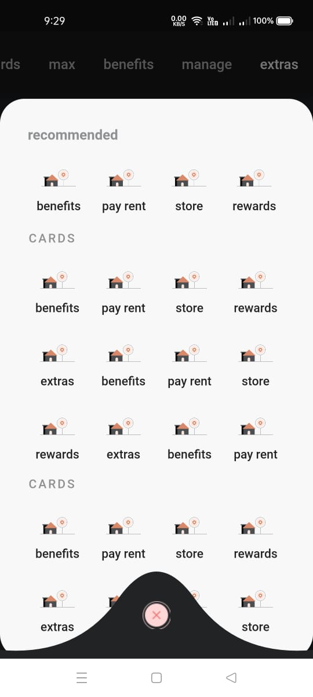

# CRED Clone in Flutter

This is a clone of CRED application. Build using Flutter and Dart.
A clone app of Cred using Flutter in GitHub is a mobile application that replicates the functionality of the Cred app, built using the Flutter framework and hosted on GitHub. Cred is a popular credit card bill payment and management platform that allows users to pay their credit card bills through the app and earn rewards points. The clone app built using Flutter is a mobile app that can be installed on both Android and iOS devices. The app has a similar user interface and features as the original Cred app, including a dashboard that displays the user's credit card bills, payment history, and reward points earned. Users can make payments through the app and earn reward points for timely payments. The clone app is built using the Flutter framework, which is a popular open-source mobile application development framework used to build high-performance, natively compiled applications for mobile, web, and desktop. It allows for easy customization of the app's design and functionality while also ensuring that the app runs smoothly and efficiently on both Android and iOS devices.

### Used -
- GetX for dependency injection
- GetX for State Management
- flutter_neumorphic for Neumorphic ui designs
- Tried to replicate the Clean Code Architecture
- Used local data store but tried to give some delay to mimic the network call
- Custom Path creation
- Animations

### Video sample -
https://www.linkedin.com/posts/sharmaprateek196_cred-cred-flutterdeveloper-activity-6878915968916172800-FwNW

### Screenshots -

  |    |   |   |
  |    |    |   |

### Master branch has the latest code
